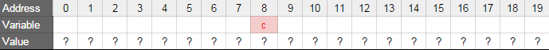
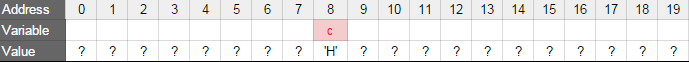
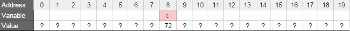
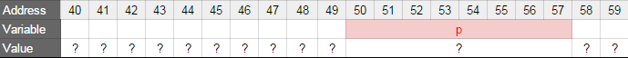
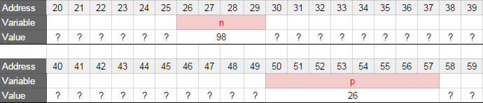

<h1> Pointers and arrays</h1>

<strong>A pointer is a variable which contains a memory address.</strong>

<h3>Types and memory</h3>
<p>
Every time you declare a variable, the computer will reserve memory for this variable. The memory reserved will then store the value of the variable.
Depending on the type of the variable, the computer will reserve more or less memory. The size of each type is generally defined in bytes (1 byte = 8 bits, each bit being 0 or 1). The sizes of the types also depend on the computer you are using. Here are the sizes of the most common types on most 64-bit Linux machines:
</p>
<li>char -> 1 byte
<li>int -> 4 bytes
<li>float -> 4 bytes
    <br><br>
To determine the size of those types on your computer, you can use the sizeof operator.<br>

```
ubuntu@ip-172-31-63-244:~/julien$ cat 0-main.c
#include <stdio.h>

/**
 * main - using sizeof to dynamically determine the size of types char, int and float
 *
 * Return: Always 0.
 */
int main(void)
{
   int n; 

   printf("Size of type 'char' on my computer: %lu bytes\n", sizeof(char));
   printf("Size of type 'int' on my computer: %lu bytes\n", sizeof(int));
   printf("Size of type 'float' on my computer: %lu bytes\n", sizeof(float));
   printf("Size of type of my variable n on my computer: %lu bytes\n", sizeof(n));
   return (0);
}
ubuntu@ip-172-31-63-244:~/julien$ gcc -Wall -Wextra -Werror -pedantic -std=gnu89 0-main.c -o sizeof && ./sizeof
Size of type 'char' on my computer: 1 bytes
Size of type 'int' on my computer: 4 bytes
Size of type 'float' on my computer: 4 bytes
Size of type of my variable n on my computer: 4 bytes
```
<br>

<p>
    The size of a type will determine how many different possible values a variable of this type can hold. For instance, a char variable could only hold 256 (2^8, 8 being the number of bits) different values: from -128 to 127. And because the size of int is 4 bytes, so 32 bits, an int variable can hold 2^32 different possible values.
<br><br>
    When we declare a variable, the computer will reserve the right amount of space for the variable in the memory (depending on its type). The space reserved for the variable is its address. And when we assign a value to this variable, the computer will store this value at its address.   
</p>
<br>

```
char c;
```

<br>
<p>
In this example, we simply declare a variable c of type char. The address of c is 8. At this stage, you have not assigned a value to your variable c. So you do not know its value. It depends on what this memory address was used for before. You should never assumed that it is 0.
</p>
<br>

```
char c;  

c = 'H';  
```
<br>

<p>When we assign the value 'H' to c, then 'H' is stored at c‘s address.</p>
<br>


<br>
<p>
But you know that a byte can only store numbers. So actually, the byte will not hold exactly the letter 'H', but its ascii code, which is 72 (man ascii). So it really looks like this in memory:
</p>
<br><br>


<br><br>
<p>Since integers are stored within four bytes of memory, the same example with an int variable would look like this:
</p>
<br><br>

```
int n;  

n = 98;  
```

<br><br>


<br><br>

<p>In this example, the address of the variable n is the smallest address of its bytes, so in this example, 26.
Note that you do not control the address where the variable is stored. In order to know what is the address of a variable, you can use the “address-of unary operator” &.</p>
<br><br>

```
ubuntu@ip-172-31-63-244:~/julien$ cat 1-main.c
#include <stdio.h>

/**
 * main - addresses of variables
 *
 * Return: Always 0.
 */
int main(void)
{
   char c;
   int n;

   printf("Address of variable 'c': %p\n", &c);
   printf("Address of variable 'n': %p\n", &n);
   return (0);
}
ubuntu@ip-172-31-63-244:~/julien$ gcc 1-main.c -o address && ./address
Address of variable 'c': 0x7ffc370ef13b
Address of variable 'n': 0x7ffc370ef13c
```

<br><br>

<p>Note that:  <br><br>
<li>You can use %p to print addresses (the values of pointers) with printf
<li>This example will not compile with our regular flags -Wall -Wextra -Werror -pedantic -std=gnu89. You’ll learn why later
</p>
<br><br>

<h2><strong>Storing memory addresses</strong></h2>
<br><br>
<p>
Now that we know how to get an address, we can store it in a… pointer! :)
A pointer is simply the address of a piece of data in memory. A pointer variable is a variable that stores the address of that piece of data. Like any other variable it needs to be declared. General form is:
var_type *var;<br><br>

<li>The * tells that the variable var is a pointer…
<li>… that points to a var_type.
<li>The value of var will be a memory address holding a value of type var_type
</p>
<br>

```
int *ptr;  
```

<br>
<p>
In this example, ptr is the name of the variable, of type “pointer to an integer”. Anything that is on the left of the last * before the name of the variable will give you the type that the pointer points to.
</p>
<br>

```
/* ptr2 is a pointer to a char */  
char *ptr2  
```
<br><br>
<p>
Because a pointer is like any other variable, the computer will also reserve the right amount of memory for it to store its value. On most 64 bits machines, the size of pointers is 8 bytes.
</p>
<br><br>

```
ubuntu@ip-172-31-63-244:~/julien$ cat 2-main.c
#include <stdio.h>

/**
 * main - printing the size, in bytes, of a pointer
 *
 * Return: Always 0.
 */
int main(void)
{
   int *p;

   printf("Size of pointer: %lu\n", sizeof(p));
   return (0);
}
ubuntu@ip-172-31-63-244:~/julien$ gcc -Wall -Werror -pedantic -Wextra -std=gnu89 2-main.c -o psize && ./psize
Size of pointer: 8
```
<br><br>


<br>
<p>To get the address where a pointer is stored, you can use the same technique as for any other variable: use the & operator.
</p>
<br><br>

```
ubuntu@ip-172-31-63-244:~/julien$ cat 3-main.c
#include <stdio.h>

/**
 * main - printing the address of a pointer
 *
 * Return: Always 0.
 */
int main(void)
{
  int *p;

  printf("Address of variable 'p': %p\n", &p);
  return (0);
}
ubuntu@ip-172-31-63-244:~/julien$ gcc 3-main.c -o paddress && ./paddress
Address of variable 'p': 0x7ffc9efc0de8
```

<br><br>
<p>Ok, now let’s store the address of a variable into a pointer.
</p>
<br><br>

```
int n;
int *p; 

n = 98;
p = &n; 
```
<br><br>
<p>Because &n gives us the address of the variable n, the variable p now holds the address of the variable n: p points to n. If the variable n’s address were 26, then the value of our pointer p would be 26.</p><br><br>


<br>


<br><br>

```
ubuntu@ip-172-31-63-244:~/julien$ cat 4-main.c
#include <stdio.h>

/**
 * main - storing the address of variable into a pointer
 *
 * Return: Always 0.
 */
int main(void)
{
  int n;
  int *p;

  n = 98;
  p = &n;
  printf("Address of 'n': %p\n", &n);
  printf("Value of 'p': %p\n", p);
  return (0);
}
ubuntu@ip-172-31-63-244:~/julien$ gcc 4-main.c -o pn && ./pn
Address of 'n': 0x7ffc6f64b6d4
Value of 'p': 0x7ffc6f64b6d4
```

<br><br>
<p>Remember that a pointer can only point to a variable of the type it is supposed to point to. The following example is incorrect:</p>
<br><br>

```
char c;  
int *p;  

p = &c;  
```

<br><br>

<h3><strong>Dereferencing</strong></h3>